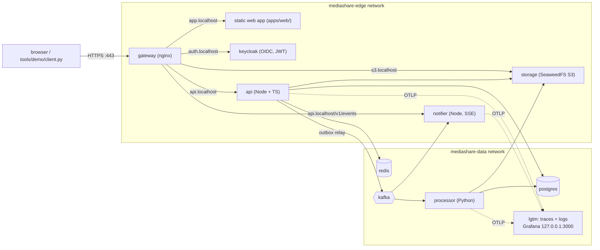

# mediashare — a distributed media-sharing platform that runs on your laptop

A small but **complete** media-sharing platform built the way production systems are:
presigned S3 uploads, eventual consistency, the transactional outbox pattern, Kafka
consumer groups with retry/DLQ, OAuth2/OIDC (with a browser app using hand-written PKCE),
live updates over Server-Sent Events, layered rate limiting, and network segmentation —
all running locally via Docker Compose.

<!-- Same diagram as in docs/ARCHITECTURE.md: keep both in sync. -->


api, notifier and storage are drawn on the edge network but also join the data network.

**Nothing but the gateway's port 443 is exposed to your host.** The gateway cannot even
reach the database, Kafka, or Redis — it only talks to `api`, `notifier` (one path),
`keycloak`, and `storage`.

## Quickstart

```bash
make up        # copies .env, generates TLS cert, builds, starts everything
make ps        # wait until everything is "healthy"
make demo      # runs the full end-to-end walkthrough (installs `requests` if needed)
```

Then open **https://app.localhost** and log in as `demo` / `demo-pass`: upload a file,
watch the progress bar, and see its status change live (`uploaded → ready`) without
refreshing.

Requirements: Docker + Docker Compose, Python 3. `make up` generates a local dev CA and a
server certificate for `app/api/auth/s3.localhost` under `infra/gateway/certs/` (macOS resolves
`*.localhost` to 127.0.0.1 automatically; on Linux add the names to `/etc/hosts` if needed).

To use the browser app (https://app.localhost) without warnings, trust the CA once, then
fully quit and reopen the browser:

```bash
sudo security add-trusted-cert -d -r trustRoot -k /Library/Keychains/System.keychain infra/gateway/certs/ca.crt  # macOS
```

The demo client narrates every step and asserts each behavior:

1. call the API without a token → 401
2. obtain an OIDC access token from Keycloak (JWT claims shown)
3. register file metadata → receive a **presigned S3 upload URL**
4. replay the same `Idempotency-Key` → the original file, no duplicate
5. upload bytes **directly to S3** through the gateway — no auth header, no API hop
   - 5b. open the live event stream: 401 without a token, then connect with one
6. confirm the upload → API writes an **outbox event** in the same transaction
7. poll status: `pending → uploaded → processing → ready` (**eventual consistency**)
   - 7b. the same result also arrived **pushed over SSE** (`file.ready`)
8. compare sha256 of the processed file against the local file
9. download the original via a short-lived presigned URL; fetch the **public** thumbnail
10. upload an "infected" file → processor detects it, purges the object, status `infected`, downloads blocked (403)
11. burst 12 mutations → the per-user Redis token bucket returns 429s (client honors `Retry-After`)
12. RBAC: regular user's DELETE → 403; admin's DELETE → 204
13. CORS: only `https://app.localhost` may call the api and PUT to presigned S3 URLs
14. list files

## Users (seeded in the Keycloak realm)

| user   | password   | realm roles   |
|--------|------------|---------------|
| demo   | demo-pass  | user          |
| admin  | admin-pass | user, admin   |

Keycloak admin console: `https://auth.localhost/admin` (user `admin`, password from
`KEYCLOAK_ADMIN_PASSWORD` in `.env`).

## The services

| service    | stack          | role                                                             |
|------------|----------------|------------------------------------------------------------------|
| gateway    | nginx          | TLS termination, host routing, per-IP rate limit, security headers, serves the web app |
| web        | static HTML + ES modules | browser app: PKCE login, direct-to-S3 upload with progress, live status (no build step) |
| keycloak   | Keycloak 26    | OIDC identity provider, issues JWTs                              |
| api        | Node 24 + TS (Fastify 5) | public REST API: auth, presigned URLs, idempotency, outbox relay |
| processor  | Python 3.14    | Kafka consumer: malware scan, thumbnails, retry/DLQ, idempotent CAS claim |
| notifier   | Node 24 + TS   | second Kafka consumer group: webhooks + SSE stream `/v1/events` to the browser |
| postgres   | Postgres 18    | file metadata + outbox table, least-privilege per-service roles  |
| kafka      | Kafka 4.3 (KRaft) | event backbone: `file-events`, `-retry`, `-dlq`              |
| storage    | SeaweedFS 4.47 | S3-compatible object store: private + public buckets, scoped IAM identities |
| redis      | Redis 8        | per-user token-bucket rate limiting (atomic Lua script)          |

## API surface (all behind `https://api.localhost`)

| method | path                        | auth        | notes                                    |
|--------|-----------------------------|-------------|------------------------------------------|
| GET    | `/healthz`, `/readyz`       | none        | liveness / readiness (checks pg + redis) |
| GET    | `/v1/files`                 | bearer JWT  | own files, `limit`/`offset`              |
| GET    | `/v1/files/:id`             | bearer JWT  | owner, admin, or anyone if Published (404 otherwise) |
| PATCH  | `/v1/files/:id`             | bearer JWT  | owner only: `{visibility: private\|public}` |
| POST   | `/v1/files`                 | bearer JWT  | optional `Idempotency-Key` header        |
| POST   | `/v1/files/:id/complete`    | bearer JWT  | verifies object exists + size matches    |
| POST   | `/v1/files/:id/download-url`| bearer JWT  | 5-minute presigned GET URL; same read rule as GET |
| PUT/DELETE | `/v1/files/:id/like`    | bearer JWT  | like / unlike a Published file (idempotent) |
| GET    | `/v1/feed`                  | bearer JWT  | Published files of people you follow; `limit`, opaque `cursor` |
| GET    | `/v1/users?q=`              | bearer JWT  | username prefix search                   |
| GET    | `/v1/users/:username`       | bearer JWT  | profile: follower/following counts       |
| PUT/DELETE | `/v1/users/:username/follow` | bearer JWT | follow / unfollow (idempotent)       |
| DELETE | `/v1/files/:id`             | role `admin`| purges objects + row                     |
| GET    | `/v1/events`                | bearer JWT  | SSE stream of your file events (served by the notifier); closed at token expiry |

CORS: only the origin `https://app.localhost` is allowed (api and presigned S3 URLs).

## Repository layout

```
apps/                  what gets deployed
  api/                 Node + TS REST API, outbox relay
  notifier/            Node + TS Kafka consumer + SSE endpoint
  processor/           Python worker (scan, thumbnail, retry/DLQ)
  web/                 browser app (ES modules, no build step)
  node.Dockerfile      one image recipe for both Node apps
packages/
  auth/                shared JWT verification (@mediashare/auth)
infra/                 config for third-party components
  gateway/             nginx config + TLS certs
  keycloak/            realm import
  postgres/init/       schema + roles (fresh volume only)
tools/                 dev and test tooling, never deployed
  demo/                end-to-end client (`make demo`)
  scripts/             experiments, cert generation
docs/                  architecture, security, Q&A, ADRs, roadmap
```

Node services are a **pnpm workspace** (`pnpm-workspace.yaml`, lockfile `pnpm-lock.yaml`), built
by one two-stage `apps/node.Dockerfile` from the repo root: the build stage installs with
`--frozen-lockfile` and compiles, then `pnpm deploy --prod` writes just the service's `dist/`
and production dependencies for the runtime image. For editor types locally: `pnpm install`
(pnpm is pinned in `package.json` → `packageManager`; `corepack enable` provides it).

## Exploring the running system

```bash
make logs                                                      # follow all services
make kafka-ui                                                  # read-only Kafka dashboard: http://127.0.0.1:8080
docker compose exec kafka /opt/kafka/bin/kafka-console-consumer.sh \
  --bootstrap-server localhost:9092 --topic file-events --from-beginning
docker compose exec kafka /opt/kafka/bin/kafka-console-consumer.sh \
  --bootstrap-server localhost:9092 --topic file-events-dlq --from-beginning
docker compose exec postgres psql -U api_user -d mediashare \
  -c "SELECT id, filename, status FROM files ORDER BY created_at DESC;"
docker compose exec storage weed shell <<< "s3.bucket.list"
curl --cacert infra/gateway/certs/ca.crt https://s3.localhost/media-thumbnails/<thumbKey>   # public bucket, no auth
docker compose logs -f notifier | grep sse                     # SSE streams opening/closing
```

## Documentation

- [docs/ARCHITECTURE.md](docs/ARCHITECTURE.md) — components, data flows, topics, state machine
- [docs/SECURITY.md](docs/SECURITY.md) — threat model and every control, with trade-offs
- [docs/DESIGN-DECISIONS.md](docs/DESIGN-DECISIONS.md) — Q&A walkthrough of every design decision, mapped to concrete code paths
- [docs/ROADMAP.md](docs/ROADMAP.md) — learning roadmap: interactive UI → tracing → scaling → failure injection → advanced topics

## Teardown

```bash
make down      # stop (keeps data)
make reset     # stop + wipe volumes
```
