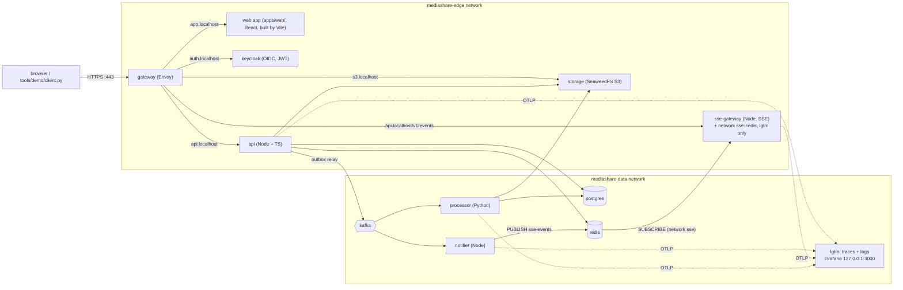
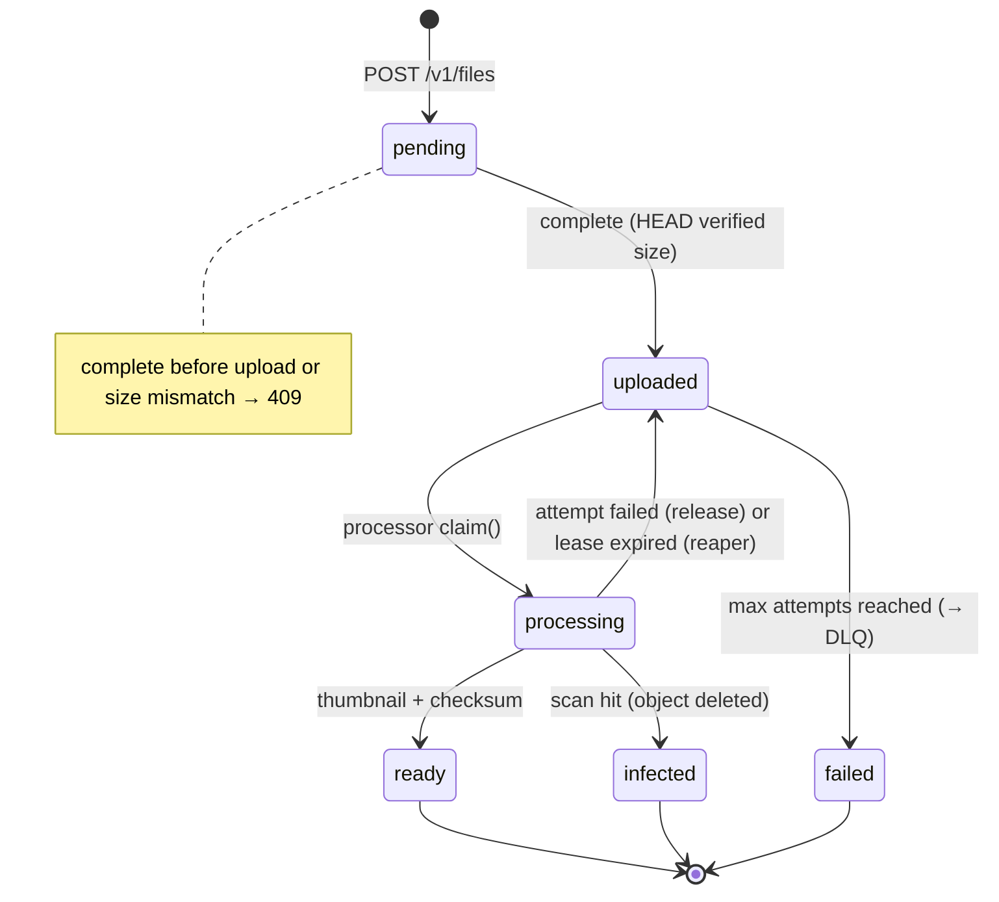
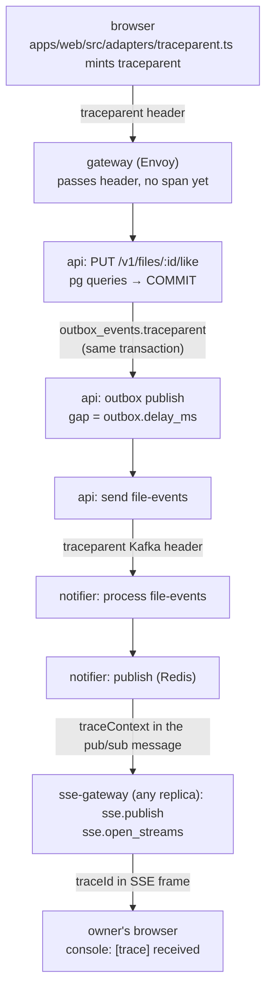

# Architecture

## Bird's-eye view

Three tiers, two networks, one exposed port.

<!-- Same diagram as in README.md: keep both in sync. -->


Network rules (enforced by Docker, mirroring VPC subnets + security groups):

A third network, **sse**, holds only `sse-gateway`, `redis` and `lgtm`: the gateway's
back side, so the one other internet-facing service never shares a network with Kafka or
Postgres.

| container   | edge | data | sse | can be reached by              | can reach                       |
|-------------|------|------|-----|--------------------------------|---------------------------------|
| gateway     | ✔    | ✖    | ✖   | internet (host :443 only)      | api, sse-gateway, keycloak, storage |
| keycloak    | ✔    | ✖    | ✖   | gateway (proxy + JWKS), api, sse-gateway (JWKS) | (nothing it needs)              |
| api         | ✔    | ✔    | ✖   | gateway (public), internal     | keycloak, postgres, redis, kafka, storage |
| storage     | ✔    | ✔    | ✖   | gateway (S3 endpoint), internal| (nothing it needs)              |
| postgres    | ✖    | ✔    | ✖   | api, processor                 | —                               |
| kafka       | ✖    | ✔    | ✖   | api, processor, notifier       | —                               |
| redis       | ✖    | ✔    | ✔   | api, notifier, sse-gateway (ACL: SUBSCRIBE only) | —             |
| processor   | ✖    | ✔    | ✖   | internal only                  | postgres, kafka, storage        |
| notifier    | ✖    | ✔    | ✖   | internal only                  | kafka, redis (ACL: PUBLISH only), webhook egress |
| sse-gateway | ✔    | ✖    | ✔   | gateway (`/v1/events` only)    | redis, keycloak, lgtm           |
| lgtm        | ✖    | ✔    | ✔   | api, processor, notifier, sse-gateway (OTLP); host loopback :3000 | — |

The gateway is *physically incapable* of reaching the database, Kafka, or Redis. Even if
Envoy were fully compromised, data stores are unreachable from it. The processor is not on
the edge network at all, and neither is the notifier. The browser's SSE stream is served by
`sse-gateway`, which can reach Redis but not Kafka or Postgres: see "SSE gateway edge
exposure" in [SECURITY.md](SECURITY.md) and ADR 0005.

## The upload flow (the full sequence)

```mermaid
sequenceDiagram
  autonumber
  participant C as client
  participant K as keycloak
  participant A as api
  participant P as postgres
  participant S as storage (S3)
  participant Q as kafka
  participant W as processor
  participant N as notifier

  C->>K: POST /realms/media/token
  K-->>C: access token (JWT)
  C->>A: POST /v1/files {meta}
  Note over C,A: gateway verifies the JWT first (jwt_authn); bad tokens stop there
  A->>A: verify JWT locally (JWKS)
  A->>P: INSERT files (status = pending)
  A-->>C: {id, presigned PUT url}
  C->>S: PUT bytes (presigned, no api involved)
  S-->>C: 200
  C->>A: POST /v1/files/:id/complete
  A->>S: HEAD object (size check)
  A->>P: TX: status = uploaded + INSERT outbox_events
  A-->>C: 202
  loop relay, every 250 ms
    A->>P: SELECT unpublished FOR UPDATE SKIP LOCKED
    A->>Q: publish file.uploaded (key = fileId)
    A->>P: mark published_at = now()
  end
  Q->>W: consume file.uploaded
  W->>P: claim(): uploaded → processing
  W->>S: GET object
  W->>W: scan + checksum + thumbnail
  W->>S: PUT thumbnail
  W->>P: status = ready, checksum
  W->>Q: file.ready
  Q->>N: consume file.ready
  N-->>C: SSE event (if a tab is connected)
  C->>A: GET /v1/files/:id (or poll)
  A-->>C: status ready + thumbnail URL
```

## File state machine (eventual consistency)



Clients can poll `GET /v1/files/:id` (the demo does), or subscribe to push: the browser
keeps an SSE stream to `GET /v1/events` (`sse-gateway`,
`apps/sse-gateway/src/sse/events-server.ts`). The notifier consumes `file-events` and
publishes each event for its owner to the Redis channel `sse-events`
(`apps/notifier/src/redis/publisher.ts`); every `sse-gateway` replica subscribes and writes
it to the streams it holds for that user (`apps/sse-gateway/src/redis/subscriber.ts`), so
it doesn't matter which replica a tab landed on. The channel and message format are one
shared package, `@mediashare/live-events`, so the two sides can't drift apart.

## Data model (postgres)

`files` — one row per upload: `id` (uuid), `owner_id` (JWT `sub`), metadata, `status`,
`object_key`, `thumbnail_key`, `checksum` (sha256, computed by the processor), optional
`idempotency_key` with a **partial unique index** `(owner_id, idempotency_key)`.

`outbox_events` — the transactional outbox: `event_id`, `aggregate_id` (fileId, used as the
Kafka message key), `event_type`, `payload` jsonb, `traceparent` (trace context of the
request that wrote the row, see "Tracing"), `published_at` (null until relayed).

Roles: `api_user` (DML on both tables), `processor_user` (SELECT/UPDATE on `files` only).
DDL is owned by the init job, not by any service — services never create tables.

## Kafka topology

| topic             | partitions | retention | writers            | readers                        |
|-------------------|-----------|-----------|--------------------|--------------------------------|
| `file-events`     | 3         | default   | api relay, processor (emits result events) | processor, notifier |
| `file-events-retry`| 3        | default   | processor          | processor                      |
| `file-events-dlq` | 1         | 7 days    | processor          | (ops / inspection)             |

- Messages are keyed by `fileId` → **all events for one file land on the same partition**,
  so per-file ordering is guaranteed while different files process in parallel.
- Two **consumer groups** (`processor`, `notifier`) read the same topic independently —
  each has its own committed offsets. Notifier progress never blocks processing.
- Topics are provisioned by a `kafka-init` job before any consumer starts; auto-topic-creation
  is disabled (a broker that silently creates topics on typo is a production hazard).
- `KAFKA_NUM_PARTITIONS=3` is also the ceiling for processor parallelism: at most 3
  processor containers process concurrently per group — a concrete scaling lever to discuss.

## Event envelope

```json
{
  "eventId": "uuid",           // unique per publication, used for tracing
  "eventType": "file.uploaded",
  "aggregateId": "fileId",     // Kafka message key
  "occurredAt": "2026-09-24T07:51:49Z",
  "payload": { ... },
  "attempt": 0                 // only present on retry-topic messages
}
```

Event types: `file.uploaded` (api → pipeline), `file.ready` / `file.rejected` /
`file.failed` (processor → notifier).

## Why the outbox (the dual-write problem)

`complete` must change the DB *and* cause an event. If you `UPDATE` then `produce()`
and the producer call fails, the state change is stranded — no event, no processing,
file stuck in `uploaded`. If you produce first and the `UPDATE` fails, you process a
file the DB thinks is still `pending`. Either order has a failure window.

The outbox makes the event *part of the same transaction* as the state change: an
insert into `outbox_events`. A relay loop then publishes rows with
`published_at IS NULL` using `SELECT ... FOR UPDATE SKIP LOCKED` (safe with multiple
relay instances) and marks them published in the same DB transaction.

Delivery semantic is **at-least-once**: if the relay crashes between `produce()` and
`COMMIT`, the row rolls back and will be published again. Consumers therefore must be
idempotent — the processor's `claim()` is exactly that (see DESIGN-DECISIONS.md). Debezium/CDC
is the "industrial" version of this pattern (reading the WAL instead of polling a table).

## Tracing (one action = one trace)

Every service sends OpenTelemetry traces and logs over OTLP to `lgtm` (`grafana/otel-lgtm`:
collector + Tempo for traces + Loki for logs + Prometheus + Grafana). Open Grafana →
Explore → Tempo at http://127.0.0.1:3000. A like is one trace:



Upload: `POST …/complete` → outbox → `processor handle file.uploaded` (claim, S3 get,
`scan`, `thumbnail`, S3 put, mark ready) → `file-events send` → notifier.

How the context crosses each hop:

| hop | carrier | who does it |
|-----|---------|-------------|
| browser → api | `traceparent` HTTP header (CORS must allow it) | `apps/web/src/adapters/http.ts`, http instrumentation |
| request → relay | `outbox_events.traceparent` column | `insertOutboxEvent` / `publishRow` (by hand) |
| relay/processor → Kafka → consumer | `traceparent` Kafka header | kafkajs / confluent-kafka instrumentation |
| Kafka → processor handler | header extracted by hand | `apps/processor/src/kafka_loop.py` (the auto span only *links*) |
| notifier → sse-gateway | `traceContext` field in the Redis pub/sub message | `encodeLiveEvent` / `decodeLiveEvent` in `packages/live-events` (by hand) |
| notifier → browser | `traceId` field in the SSE frame | `StreamRegistry.publish` |

Rule of thumb: automatic propagation lives in memory (async context) and stops at any
async boundary that stores data, like a DB row or an already-open stream. There the
context must travel *with the data*.

Setup is zero-code: env in the `x-otel-env` / `x-node-otel-env` anchors (`compose/apps.yml`)
(`NODE_OPTIONS` loads the ESM hook + auto-instrumentations; the processor starts via
`opentelemetry-instrument`). Only the propagation gaps above and a few spans are code.
Logs carry `trace_id` (pino instrumentation; `log.JsonFormatter` in the processor).
The relay's 250 ms poll runs with tracing suppressed, so idle ticks create no traces.

## Component inventory (and its AWS mapping)

| here           | in a cloud deployment                              |
|----------------|-----------------------------------------------------|
| gateway        | ALB / API Gateway + WAF + CloudFront for the S3 host |
| keycloak       | Cognito user pool (or managed Keycloak)             |
| api            | ECS Fargate / EKS pods, autoscaled                  |
| processor      | ECS/K8s workers, one per partition (max 3)          |
| notifier       | ECS/K8s + SQS/SNS or webhook fan-out service        |
| sse-gateway    | ECS/K8s behind the ALB; ElastiCache pub/sub with an ACL user (or API Gateway WebSockets / AppSync) |
| storage        | S3 (presigned URLs work identically)                |
| kafka          | MSK                                                 |
| postgres       | RDS (per-service users, or separate DBs)            |
| redis          | ElastiCache                                         |
| lgtm           | ADOT collector → X-Ray/CloudWatch, or Grafana Cloud  |

The services deliberately speak standard protocols only — the AWS SDK for S3, plain
Kafka/Postgres/Redis clients, OIDC for auth — so the swap from local services to managed
cloud ones is configuration, not code.

## Scaling notes

- **api** is stateless (JWT validation is local; no server-side session) → horizontal scale
  behind the gateway: `API_REPLICAS=3` (default 1); Envoy finds replicas via Docker DNS and
  round-robins. First things to watch: postgres connection pool (`max: 10` per pod)
  and JWKS cache hit rate. Measured (k6, limits off): the pool pins first — write
  transactions hold connections through fsync-bound COMMITs, and likes on one file
  serialize on its `files` row; reads queue behind them. Saturation = latency, not errors.
- **processor/notifier** scale to partition count, not beyond (3 here). More partitions =
  more parallelism, but per-file ordering only holds while the key-based mapping is stable.
- **storage** is a single `weed mini` node here — appropriate for a laptop; SeaweedFS scales
  by adding volume servers (see its docs) and S3 gateways are stateless behind a balancer.
- Hot objects (thumbnails) are the CDN story: public bucket + `Cache-Control` → served at
  the edge, presigned originals never cached.
